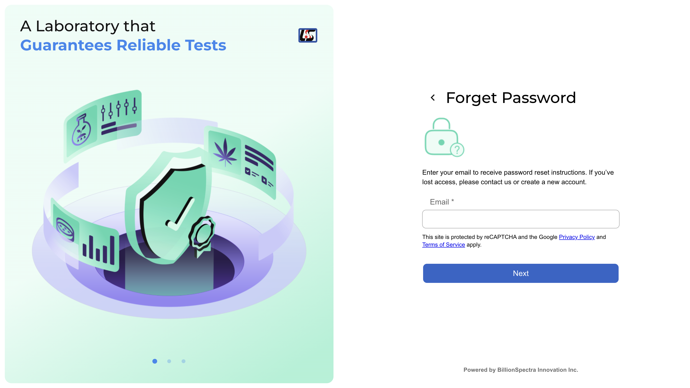

# SpectraLab Client Portal (Overview)

Welcome to the **SpectraLab Client Portal** overview repository. This project showcases a client-focused web application developed for **SpectraLab Scientific Inc.**, a Canadian company specializing in analytical lab equipment sales and servicing.

> ⚠️ **Important:** This repository does **not** contain any source code due to client confidentiality. Instead, it provides **images and descriptions** of the portal's features and UI. All information included is for demonstration only.

---

## 🧭 Project Summary

The portal was built to streamline interactions between customers and the SpectraLab team. It features two distinct user experiences:

- **Customers** can:
  - Track equipment orders and service status
  - Submit service requests
  - View product warranty and logistics info
  - Manage their profile

- **Admins** can:
  - Manage work orders and repair status
  - Review and fulfill equipment orders
  - Handle customer service requests
  - Maintain internal rosters and account information
  - Manage user access in the organization
**Based on the different roles of users, they would have different access to the functions mentioned above**

---

## 🛠️ Tech Stack

This project uses a full-stack TypeScript setup:

- **Frontend:** React + TypeScript + Material UI
- **Backend:** Node.js + Express
- **Database:** MySQL
- **Shared Logic:** Node-based utility library (interfaces, constants, helpers)
- **Deployment:** Internal beta testing before full rollout

---

## 🔒 About This Repo

Due to the proprietary nature of the project and internal data policies, the actual source code and live deployment cannot be shared publicly.

This repo is intended solely to:
- Demonstrate the design and structure of the portal
- Explain the workflow and key features
- Provide visual examples for portfolio and discussion purposes

---

## 📸 Portal Snapshots

> Upload your screenshots in this section and describe each view briefly. You can format it like this:

### Login Page

### Forget Password Page

A high-level overview for customers showing current orders, open service requests, and quick access to support.

### Admin Work Order Management

An internal admin view to manage customer repair requests, assign technicians, and update statuses.

<!-- Add more screenshots and descriptions below -->

---

## 📇 Contact

For more details about the project or to discuss the implementation, feel free to reach out via [LinkedIn](https://www.linkedin.com/in/your-profile) or [email](mailto:your.email@example.com).

---

